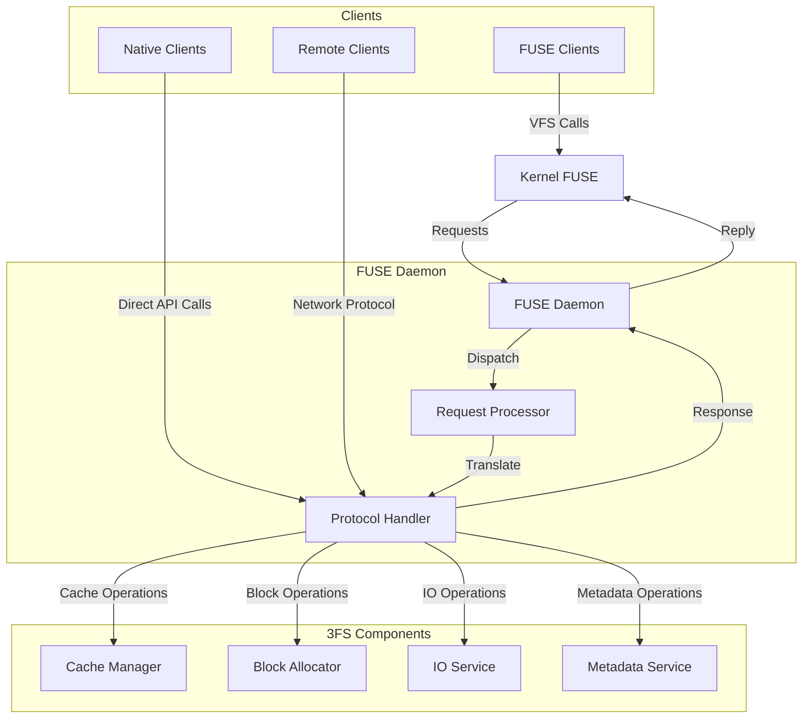

```mermaid
graph TD
    subgraph "Clients"
        FC[FUSE Clients]
        NC[Native Clients]
        RC[Remote Clients]
    end

    subgraph "FUSE Daemon"
        FD[FUSE Daemon]
        RP[Request Processor]
        PH[Protocol Handler]
    end
    
    subgraph "3FS Components"
        CM[Cache Manager]
        BA[Block Allocator]
        IO[IO Service]
        MD[Metadata Service]
    end
    
    FC -->|VFS Calls| K[Kernel FUSE]
    K -->|Requests| FD
    
    NC -->|Direct API Calls| PH
    RC -->|Network Protocol| PH
    
    FD -->|Dispatch| RP
    RP -->|Translate| PH
    
    PH -->|Cache Operations| CM
    PH -->|Block Operations| BA
    PH -->|IO Operations| IO
    PH -->|Metadata Operations| MD
    
    PH -->|Response| FD
    FD -->|Reply| K
```
