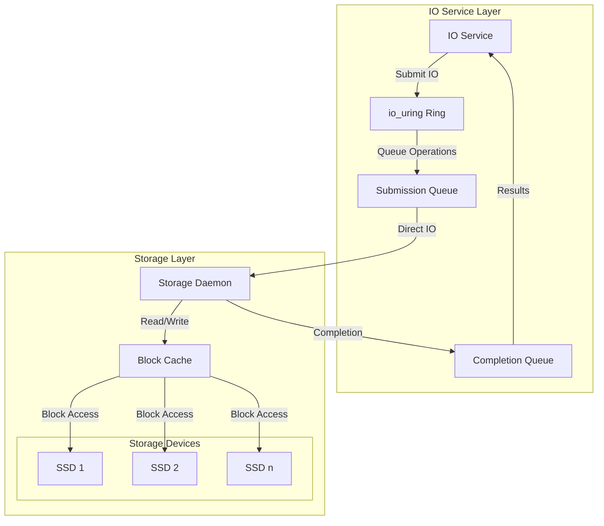

```mermaid
graph TD
    subgraph "IO Service Layer"
        IO[IO Service]
        IOR[io_uring Ring]
        SQ[Submission Queue]
        CQ[Completion Queue]
    end

    subgraph "Storage Layer"
        SD[Storage Daemon]
        BC[Block Cache]
        subgraph "Storage Devices"
            SSD1[SSD 1]
            SSD2[SSD 2]
            SSDn[SSD n]
        end
    end

    IO -->|Submit IO| IOR
    IOR -->|Queue Operations| SQ
    SQ -->|Direct IO| SD
    SD -->|Read/Write| BC
    BC -->|Block Access| SSD1
    BC -->|Block Access| SSD2
    BC -->|Block Access| SSDn
    SD -->|Completion| CQ
    CQ -->|Results| IO
```
