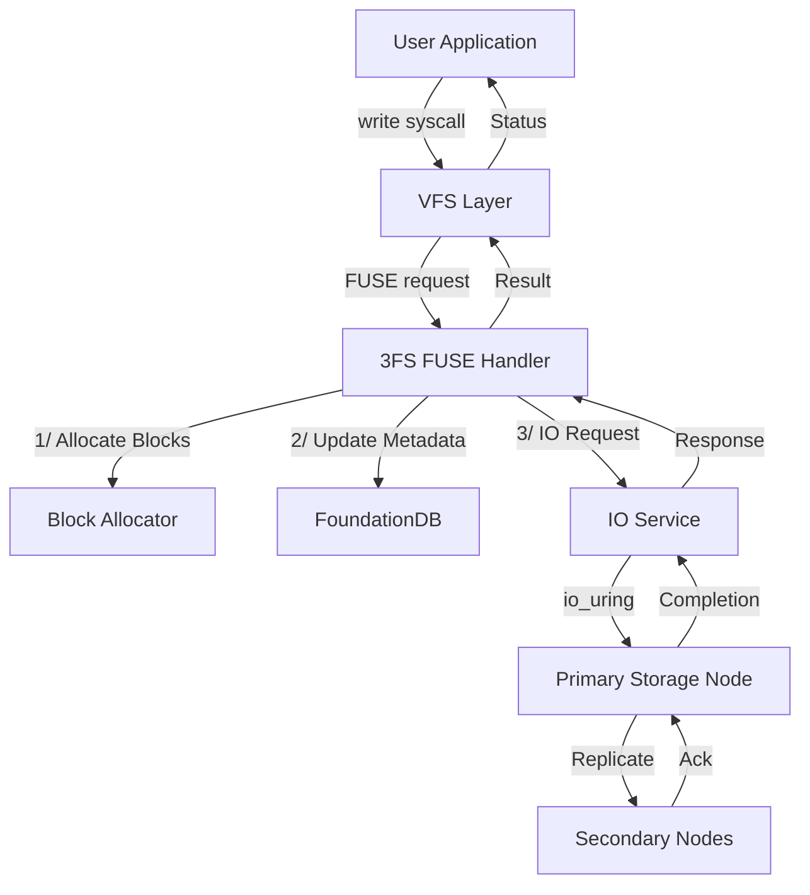

```mermaid
graph TD
    A[User Application] -->|write syscall| B[VFS Layer]
    B -->|FUSE request| C[3FS FUSE Handler]
    C -->|1/ Allocate Blocks| D[Block Allocator]
    C -->|2/ Update Metadata| E[FoundationDB]
    C -->|3/ IO Request| F[IO Service]
    F -->|io_uring| G[Primary Storage Node]
    G -->|Replicate| H[Secondary Nodes]
    H -->|Ack| G
    G -->|Completion| F
    F -->|Response| C
    C -->|Result| B
    B -->|Status| A
```
