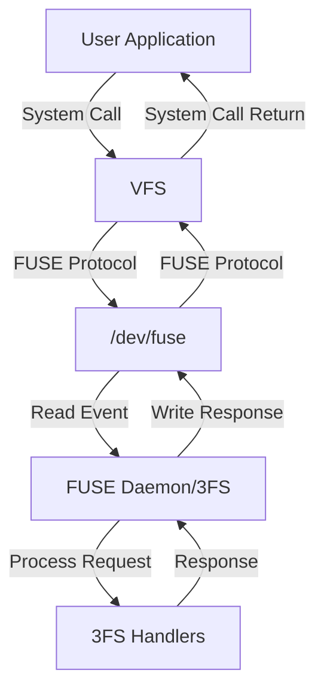

```mermaid
graph TD
    A[User Application] -->|System Call| B[VFS]
    B -->|FUSE Protocol| C["/dev/fuse"]
    C -->|Read Event| D[FUSE Daemon/3FS]
    D -->|Process Request| E[3FS Handlers]
    E -->|Response| D
    D -->|Write Response| C
    C -->|FUSE Protocol| B
    B -->|System Call Return| A
```
